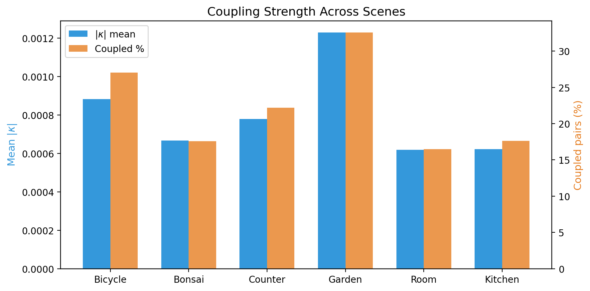
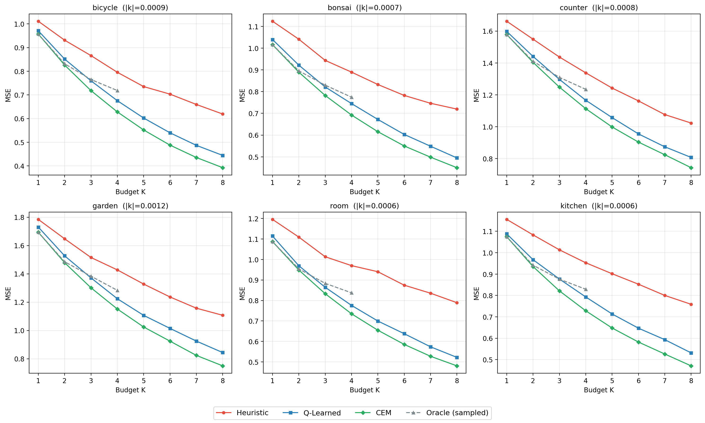
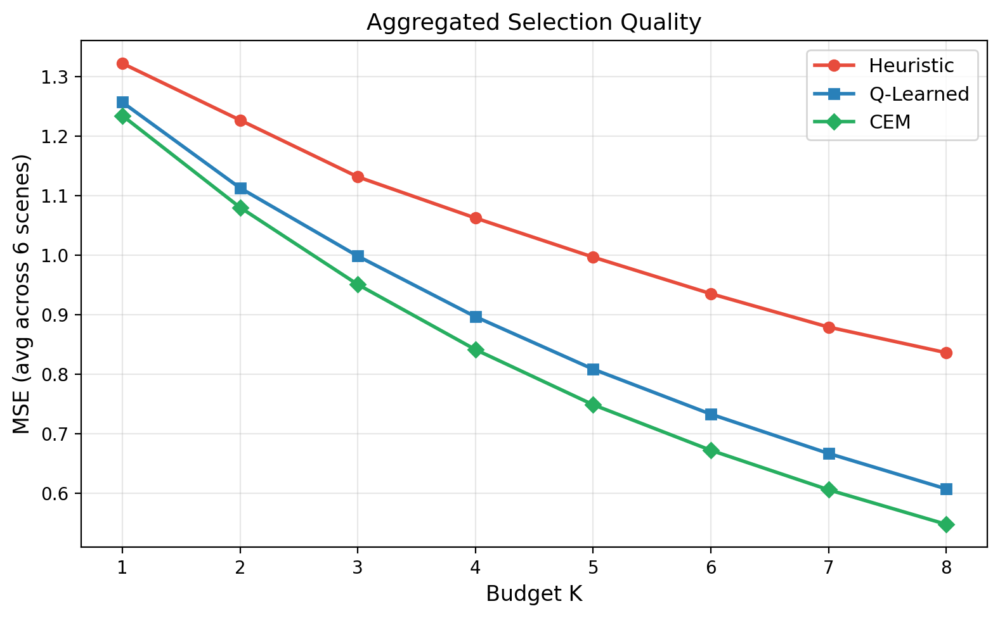
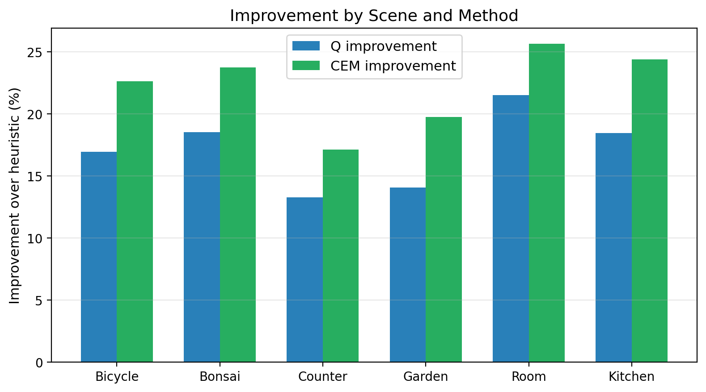
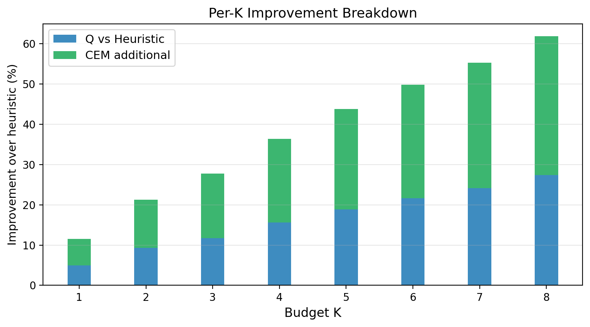
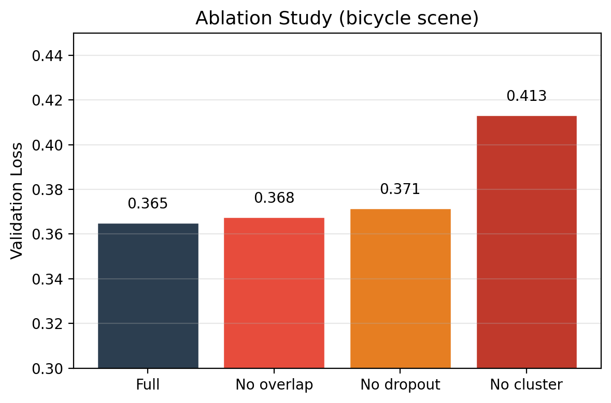
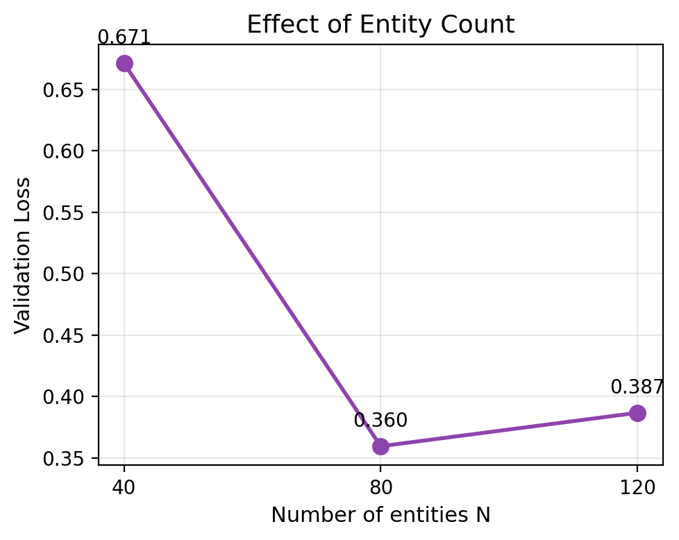

# Memory Update Decisions as Constrained Resource Allocation in 3D Reconstruction

[](https://opensource.org/licenses/MIT)
[](https://www.python.org/downloads/)
[](https://www.kaggle.com/code/datatalesbyagos/memory-update-decisions)

Entity-level memory update decisions in 3D Gaussian Splatting exhibit **non-separable coupling** (κ ≠ 0). A learned Q-function outperforms heuristic baselines under a compute budget.

## Key Results

| Metric | Value |
|--------|-------|
| Mean \|κ\| (6 scenes) | 0.0008 (range 0.0006–0.0012) |
| Q improvement vs heuristic | +17.1% ± 2.8% |
| CEM improvement vs heuristic | +22.2% ± 2.9% |
| Coupled entity pairs | 22.3% on average |
| Architecture | 16→64→32→1 MLP, ~40KB |

## Coupling Heatmap



## Per-Scene Results



## Aggregated Comparison



## Improvement Over Baselines



## Per-K Improvement



## Ablation Study



## Varying N



## Per-Scene Breakdown

| Scene | Gaussians | \|κ\| mean | Coupled % | Q improvement | CEM improvement |
|-------|-----------|------------|-----------|---------------|-----------------|
| room | 1,130K | 0.0006 | 16.5% | +21.5% | +25.6% |
| kitchen | 1,685K | 0.0006 | 17.6% | +18.4% | +24.4% |
| bonsai | 273K | 0.0007 | 17.6% | +18.5% | +23.7% |
| counter | 1,029K | 0.0008 | 22.2% | +13.3% | +17.1% |
| bicycle | 568K | 0.0009 | 27.1% | +17.0% | +22.6% |
| garden | 4,386K | 0.0012 | 32.6% | +14.1% | +19.7% |

## Setup

```bash
pip install numpy torch matplotlib scikit-learn requests scipy
```

## Usage

1. Open `code/notebook.ipynb` in Jupyter or Kaggle
2. Run all cells

The notebook will:
- Download 6 real 3DGS scenes from HuggingFace (bicycle, bonsai, counter, garden, room, kitchen)
- Build voxel proxy worlds with N=80 meta-entities
- Compute coupling matrix κ for each scene
- Train a Q-network to predict update benefit
- Evaluate: heuristic, Q-learned, CEM planner, random, frequency baselines
- Run ablation study
- Generate all figures

## Repository Structure

```
├── paper/
│   ├── main.tex          # LaTeX source
│   ├── main.bbl          # Compiled bibliography
│   ├── main.bib          # BibTeX database
│   └── figures/          # Paper figures
│       ├── fig_coupling_overview.png
│       ├── fig_per_scene_mse.png
│       ├── fig_aggregated.png
│       ├── fig_improvement.png
│       ├── fig_per_k_improvement.png
│       ├── fig_ablation.png
│       └── fig_varying_n.png
└── code/
    ├── notebook.ipynb    # Main experiment notebook
    ├── results_all.json  # Per-scene results
    ├── ablation.json     # Ablation study results
    └── summary.json      # Aggregated summary
```

## Citation

```bibtex
@article{silva2026memory,
  title={Memory Update Decisions as Constrained Resource Allocation in 3D Reconstruction},
  author={Silva, Agostina},
  year={2026}
}
```

## License

This project is licensed under the MIT License - see the [LICENSE](LICENSE) file for details.
